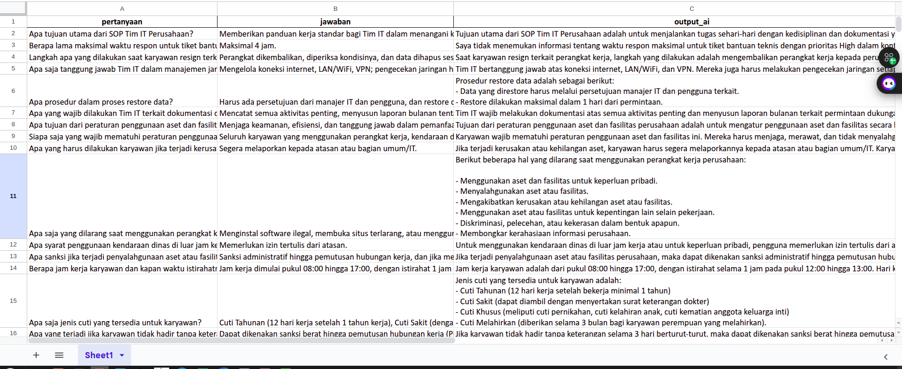

## Teknikal Test – Retrieval-Augmented Generation (RAG) System


### Deliverables
- ✅ Sistem model serving RAG berbasis open-source LLM.
- ✅ Menggunakan **PGVector** sebagai vector database (`rubythalib/pgvector:latest`).
- ✅ Dokumentasi lengkap untuk setup dan instalasi sistem.
- ✅ Spreadsheet berisi:
  - 25 pertanyaan
  - 25 jawaban dari SOP
  - 25 output jawaban dari LLM

---

## Tech Stack

| Komponen       | Teknologi                                          |
|----------------|----------------------------------------------------|
| LLM            | `llama-3.1-8b-instant` (Groq)                      |
| Embedding      | `sentence-transformers/all-MiniLM-L6-v2` (HF)      |
| Vector Store   | PGVector                                           |
| Orkestrasi     | LangChain                                          |
| API Serving    | FastAPI                                            |

---

## Instalasi & Setup
### 1. Install UV
```bash
curl -Ls https://astral.sh/uv/install.sh | bash

# Pastikan ~/.local/bin sudah masuk PATH
export PATH="$HOME/.local/bin:$PATH"
```

### 2. Clone Repository
```bash
git clone https://github.com/fahmiaziz98/technical_test.git
cd technical_test
```

### 3. Buat dan Aktivasi Virtual Environment
```bash
uv venv .venv
source .venv/bin/activate
```

### 4. Install Dependencies
```bash
uv pip install -r requirements.txt
```

### 5. Setup PGVector via Docker
```bash
docker run --name pgvector-container \
  -e POSTGRES_USER=user \
  -e POSTGRES_PASSWORD=user \
  -e POSTGRES_DB=SOP_perusahaan \
  -p 6024:5432 \
  -d rubythalib/pgvector:latest
```

### 6. Setup Environment Variables
```bash
cp .env.example .env
```
Isi file `.env` sesuai kredensial lokal kamu.  
Untuk **Groq API Key**, buat di: [https://console.groq.com/keys](https://console.groq.com/keys)

---

## Indexing Dokumen ke Vector DB

```bash
uv run etl/indexing.py
```

---

## Menjalankan API

```bash
uv run src/service.py
```

### Cek endpoint API:
`http://0.0.0.0:8000/docs`

### Contoh CURL request:

```bash
curl -X 'POST' \
  'http://0.0.0.0:8000/api/v1/ask' \
  -H 'accept: application/json' \
  -H 'Content-Type: application/json' \
  -d '{
  "session_id": "123sh",
  "query": "Apa syarat melakukan lembur dan bagaimana pelaporannya?",
  "method": "hybrid" # or 'native'
}'
```

#### Contoh Response:
```json
{
  "session_id": "123sh",
  "query": "Apa syarat melakukan lembur dan bagaimana pelaporannya?",
  "answer": "Syarat melakukan lembur adalah atas persetujuan atasan langsung. Karyawan yang bekerja di luar jam kerja reguler berhak atas kompensasi lembur. Laporan lembur harus diajukan paling lambat 1 hari kerja setelah lembur dilakukan.",
  "metadata": {
    "method": "hybrid",
    "model": "llama-3.1-8b-instant",
    "retriever_config": {
      "type": "hybrid",
      "collection": "doc_SOP_v2",
      "top_k": 3,
      "vector_store_top_k": 3,
      "bm25_top_k": 3,
      "weights": [
        0.5,
        0.5
      ],
      "rerank_top_n": 5
    }
  }
}
```

---

## Evaluasi Output LLM

```bash
uv run evaluate.py --method native --delay 5 --input evaluasi_data.xlsx
```

Hasil evaluasi dapat kamu rekap dalam bentuk spreadsheet:
- Kolom A: Pertanyaan
- Kolom B: Jawaban ground truth (SOP)
- Kolom C: Output jawaban LLM
- Kolom D: Output Native 
- Kolom D: Output Hybrid


<!--  -->


---

## Clean Up

Matikan container PGVector:
```bash
docker stop pgvector-container
docker rm pgvector-container
```

---

## TODO Checklist

- [x] Model RAG bisa menerima pertanyaan dan menjawab berdasarkan SOP perusahaan
- [x] Menggunakan PGVector image `rubythalib/pgvector:latest`
- [x] Model serving via FastAPI
- [x] Dokumentasi instalasi dan penggunaan
- [x] Script indexing dokumen ke vector DB
- [x] Endpoint API `/ask`
- [x] Evaluasi jawaban dalam format spreadsheet
- [x] Contoh CURL untuk testing manual
- [x] Penanganan `.env` dan API key Groq
- [x] Ekstraksi data menggunakan smoldocling vlm, agar hasil lebih akurat (Menggunakan GPU)
- [x] Menambahkan metode hybrid + rank dokument, reponse lebih akurat dan kontekstual

---

## Refrensi
- [Docs Langchain PGVector](https://python.langchain.com/docs/integrations/vectorstores/pgvector/)
